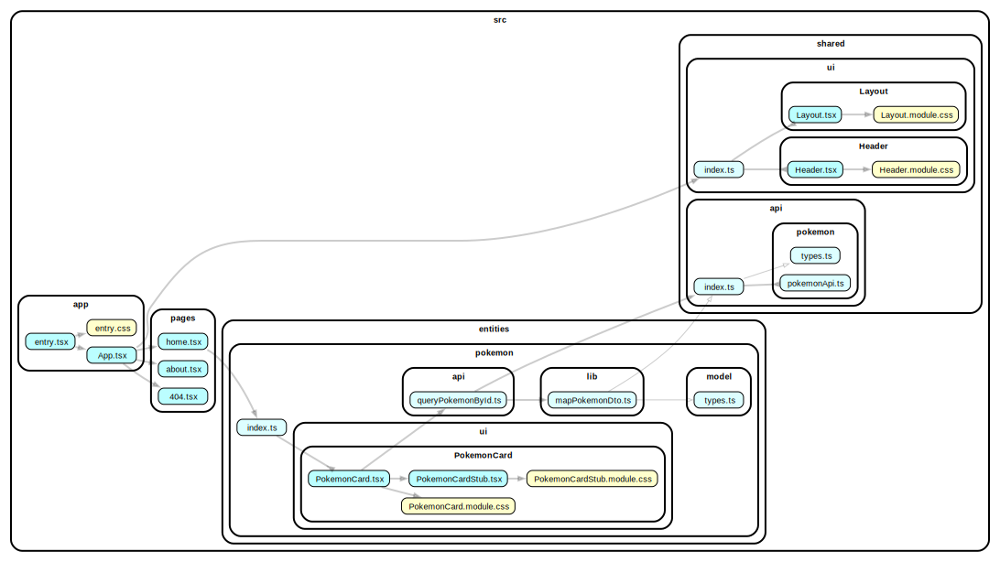

## solidjs-with-external-api

This example shows how to work with an external API (such as a REST or GraphQL backend).

In a clean architecture, the API is considered an external service, and the lower layers (domain and application layers) shouldn't know about it. To work with the API, an adapter should be implemented on infrastructure layer to convert the incompatible interfaces of external services into one compatible with our application. For more details, refer to Alexander Bespoyasov's article on [clean architecture in the frontend](https://bespoyasov.me/blog/clean-architecture-on-frontend/).

The FSD methodology follows the same principles, which means the API should be located in the shared layer, specifically in `shared/api/*`. Everything related to the API should be placed there (TypeScript interfaces for request parameters or possible responses, autogenerated types, retry mechanisms, etc.).

In the simplest case, it is sufficient to implement a fetcher function and use it throughout the application:

```tsx
// 📄 @shared/api/pokemon/pokemonApi

export const pokemonApi = {
  queryPokemonById: async (id: number) => fetch(/* ... */)
}
```

```tsx
// SolidJS example
// 📄 @entities/pokemon/ui/PokemonCard.tsx

import { pokemonApi } from './shared/api'

export function PokemonCard(props: Props) {
  const id = () => props.pokemonId
  const [data, { refetch }] = createResource(id, pokemonApi.fetchPokemonById)
  //     ^^^^ type PokemonDto (external type)

  return (
    <div>{/* ... */}</div>
  )
}
```

However, in more complex applications, we have our client-side entities whose interfaces should be separated from the API types (these types are usually referred to as DTO - Data Transfer Object). This separation reduces coupling between the external API and our application. To transform external interfaces (DTO) into internal ones, an adapter mechanism can be used. This is a simple function that takes a DTO and returns an entity model (see the example in `@entities/pokemon/lib/mapPokemonDto`). Adapters should be located near the associated entity because the external API does not know about our entities.

To connect the adapter and fetcher, you need to define a function that fetches data and transforms the external DTO into our client-side entity (see the example in `@entities/pokemon/api/queryPokemonById.ts`).

```tsx
// 📄 @entities/pokemon/api/queryPokemonById.ts

import { pokemonApi } from '@shared/api'

export async function queryPokemonById(id: number) {
  const dto = pokemonApi.fetchPokemonById(/* ... */)
  return mapPokemonDto(dto)
}
```

Use this function to retrieve data:

```tsx
// SolidJS example
// 📄 @entities/pokemon/ui/PokemonCard.tsx

import { queryPokemonById } from '../../api/queryPokemonById'

export function PokemonCard(props: Props) {
  const id = () => props.pokemonId
  const [data, { refetch }] = createResource(id, queryPokemonById)
  //     ^^^^ type Pokemon (our entity)

  return (
    <div>{/* ... */}</div>
  )
}
```

Typically, such a function is provided by data-fetching libraries (e.g., Apollo GraphQL or TanStack Query) and should be located at the layour of the associated slice.

By following this approach, you ensure that the external API is properly abstracted and that your application remains decoupled from the specifics of the external service. This leads to a cleaner and more maintainable codebase.

### Dependency Graph



### Live preview

Preview live with [StackBlitz](https://stackblitz.com/github/feature-sliced/examples/tree/master/examples/solidjs-with-external-api?file=README.md).

### How to use

Install deps and then run with npm, Yarn or pnpm to startup the example:

```bash
npm run dev
yarn dev
pnpm dev
```
