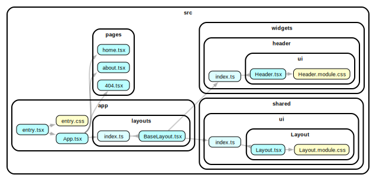

## solidjs-with-layout

This example shows how to work work with layout (or layouts). Split layout to dumb component (with markup) and smart component for widget compositions. Dumb layout can be placed in `@share/ui/Layout`, smart - `@app/layouts/BaseLayout.tsx`. See [@app/layouts/baseLayout.tsx]() and [@shared/ui/Layout/*]() in code.



### Live preview

Preview live with [StackBlitz](https://stackblitz.com/github/feature-sliced/examples/tree/master/examples/solidjs-with-layout?file=README.md).

### How to use

Install deps and then run with npm, Yarn or pnpm to startup the example:

```bash
npm run dev
yarn dev
pnpm dev
```
