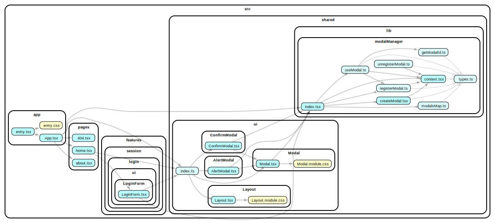

## solidjs-with-modal-manager

This example shows how to work with a modal manager. Usually, a modal manager is not used, and either the modal component is rendered inside the component using it along with the `[isOpen, setIsOpen]` state, or all modals are rendered in the root component ([пример](https://github.com/falkomerr/falkchat/blob/master/src/app/_providers/modal-provider.tsx#L34-L47
)).

This works when we have a couple of modal. But as soon as the application grows, it leads to various issues (when different arguments need to be passed to the modal, when multiple modals need to be shown simultaneously, when the modal can be used in different parts of the application).

If we consider the modal as a global representation (like a router), it is very convenient to work with it declaratively - register the modal in the DI container and use a special API for management. This way, modals will be declared near their intended place (they can be lazily loaded out of the box), collocated and there will be a single global state (just like with the application's routes), from where the modal will be managed.

The modal component (dumb markup) is located in `@/shared/ui/Modal`. Based on it, three components are made in the example (two basic components and one for working with the user flow).

- Confirm modal - `@/shared/ui/ConfirmModal`
- Alert modal - `@/shared/ui/AlertModal`
- Login modal - `@/features/session/login/ui/LoginModal`

The entire manager mechanism is moved to the segment `@/shared/lib/modalManager/*` (this is a very basic version inspired by the library https://github.com/eBay/nice-modal-react).



### Live preview

Preview live with [StackBlitz](https://stackblitz.com/github/feature-sliced/examples/tree/master/examples/solidjs-with-modal-manager?file=README.md).

### How to use

Install deps and then run with npm, Yarn or pnpm to startup the example:

```bash
npm run dev
yarn dev
pnpm dev
```
